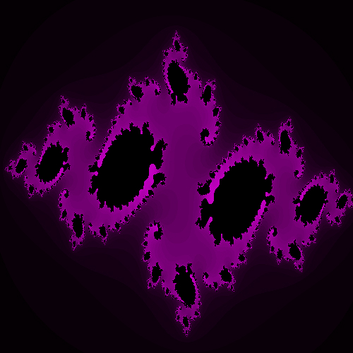
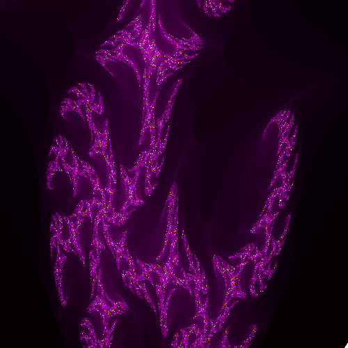
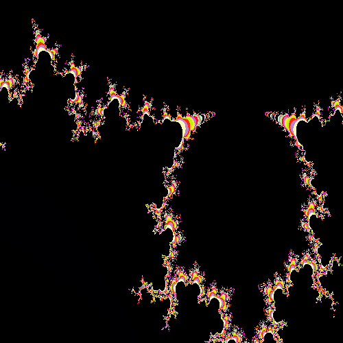

# Fractol

This project is about recreating different types of fractals using Minilibx (42's graphic library, which is based on OpenGl)
   
Usage : ./fractol [fractal_name]

Available fractals : Julia, Mandelbrot, Owo, Phoenix, Burningship, Tom

Bonuses : 

- **Scrollwheel** : Zoom in and out

- **Space** : Freeze /unfreeze fractal 

- **Right/Left arrows** : Change color set

- **Up/Down arrows** : Change LOD

- **Enter** : Save image. Enter image name in termanl. Image will saved in images/[image_names]

## Julia fractal

## Owo fractal | A fractal I came up with

## Mandelbrot

